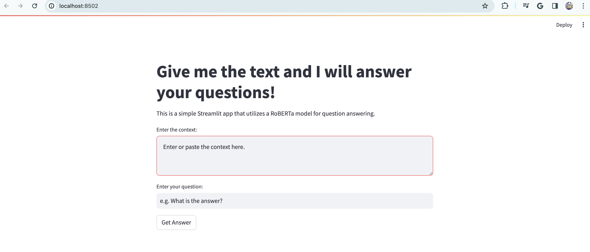

# Streamlit Hugging Face

[](https://gitlab.com/Yer1k/streamlit_hugging_face/-/commits/main)


## Features

- [**Streamlit**](https://www.streamlit.io/): Streamlit is an open-source app framework for Machine Learning and Data Science projects.
- [**Hugging Face**](https://huggingface.co/): Hugging Face is an AI research organization that provides state-of-the-art NLP models.
- [**roberta-base** for QA](https://huggingface.co/deepset/roberta-base-squad2/): RoBERTa is a transformers model pretrained on a large corpus of English data in a self-supervised fashion. This model is fine-tuned on SQuAD2.0 dataset for Question Answering task.

### Example Demo
Home page once the app is running:


Question Answering page:
Input a passage and a question, and the model will use LLM, roberta-base, on Hubbing Face to answer the question based on the passage.

For example, the passage below is retrieved from [Solar eclipse maps show 2024 totality path, peak times and how much of the eclipse you can see across the U.S.](https://www.cbsnews.com/news/solar-eclipse-path-map-2024/) on CBS News.

- Passage: "A total solar eclipse crosses North America on April 8, 2024, with parts of 15 U.S. states within the path of totality. Maps show where and when astronomy fans can see the big event. 

The total eclipse will first appear along Mexico's Pacific Coast at around 11:07 a.m. PDT, then travel across a swath of the U.S., from Texas to Maine, and into Canada.

About 31.6 million people live in the path of totality, the area where the moon will fully block out the sun, according to NASA. The path will range between 108 and 122 miles wide. An additional 150 million people live within 200 miles of the path of totality.

Solar eclipse path of totality map for 2024
Duration of 2024 total solar eclipse
The April 8 eclipse spans from Texas to Maine. Depending on your location along the path depicted on the map below, you might experience daylight transitioning into dusk for a duration of four minutes and 28 seconds."

#### Question: "When is the eclipse this year?"


#### Question: "How long is the eclipse this year?"


## How to use this app

1. Clone the repository:

```bash
git clone git@gitlab.com:Yer1k/streamlit_hugging_face.git
```

1. install the requirements:

```bash
pip install -r requirements.txt
```

1. Run the app:

```bash
streamlit run app.py
```


